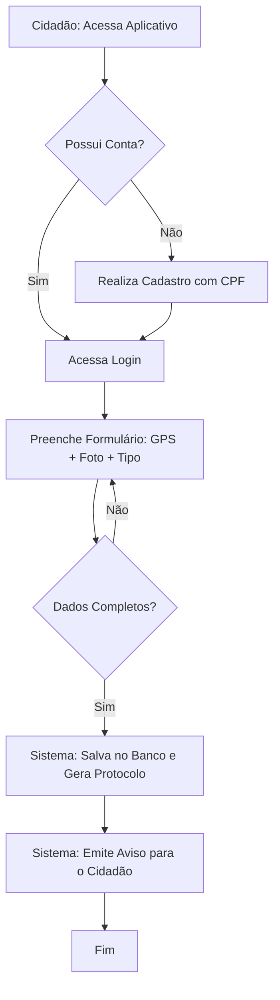
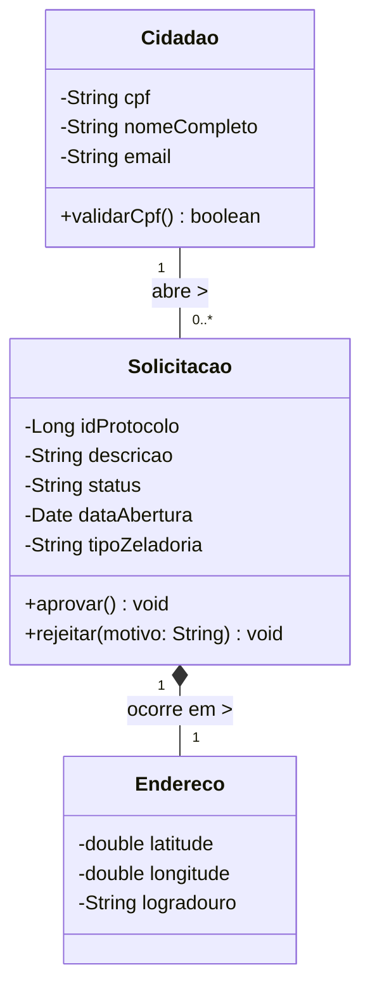
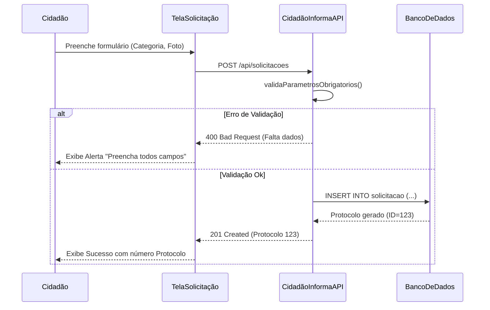

# Atividade Avaliativa - Projeto HackGov (Cidadão Informa)
**Alunos/RMs:** [Preencher Nomes e RMs da equipe]

---

## Parte 1: Refinamento do Product Backlog (SCRUM)

### 1.1 Revisão e Refinamento do Backlog (User Stories Principais)

**US01 - Registro de Ocorrência pelo Cidadão**
- **Descrição:** Como cidadão logado no app "Cidadão Informa", quero poder registrar uma ocorrência de zeladoria urbana (ex: buraco na via, lâmpada queimada) informando localização, foto e descrição, para que a prefeitura tome providências.
- **O que entra:** Captura de GPS (ou endereço manual), upload de ao menos 1 foto, seleção de categoria obrigatória.
- **O que não entra:** Acompanhamento do trabalho da equipe em tempo real no mapa (fora de escopo para MVP).
- **Critérios de Aceitação:**
  1. O sistema deve validar se o CPF do usuário é válido (integração Gov.br simulada).
  2. A ocorrência não pode ser salva sem categoria, descrição e localização.
  3. Ao salvar, o sistema deve emitir um "Protocolo de Atendimento" único.
- **Regras e Exceções:** 
  - *Exceção:* Caso as fotos passem de 5MB somadas, o sistema deve alertar sobre o limite de tamanho.
  - *Regra:* Limite de 5 chamados abertos por cidadão por dia, para evitar spam.

**US02 - Triagem e Encaminhamento pelo Atendente (Servidor Público)**
- **Descrição:** Como atendente da prefeitura, quero visualizar os novos chamados num painel de triagem, avaliar a veracidade e rotear o chamado para a secretaria correta (ex: Obras ou Iluminação), para dar prosseguimento ao atendimento.
- **O que entra:** Dashboard de listagem com filtros de data e status, botão de "Aprovar" (com roteamento) ou "Rejeitar" (com justificativa).
- **O que não entra:** Atribuição direta a uma equipe de rua específica.
- **Critérios de Aceitação:**
  1. Apenas usuários com perfil "Atendente" ou "Gestor" têm acesso à tela.
  2. Se a ocorrência for rejeitada, o cidadão deve receber a justificativa informada pelo atendente automaticamente.

### 1.2 Decomposição em Tarefas e Sprint Backlog (Sprint 1)

**Capacidade do Grupo:** 4 desenvolvedores x 15 horas semanais = 60 horas/sprint (Sprint de 2 semanas = 120 horas ou ~30 Story Points de capacidade).

| ID  | User Story Relacionada | Tarefa | Responsável | Estimativa (SP) |
| --- | --- | --- | --- | --- |
| 1 | US01 | Modelar banco de dados (Tabelas: Cidadao, Solicitacao). | Dev 1 | 2 |
| 2 | US01 | Desenvolver API REST (.NET/Java) para recebimento de denúncia (POST). | Dev 2 | 5 |
| 3 | US01 | Desenvolver tela do App (React) com formulário e botão de GPS. | Dev 3 | 5 |
| 4 | US02 | Desenvolver Endpoint para listar solicitações Pendentes (GET). | Dev 2 | 3 |
| 5 | US02 | Criar painel web (Frontend) de Triagem. | Dev 4 | 5 |
| 6 | US01 / US02 | Escrever testes automatizados de validação de regra de negócio. | Dev 1 | 3 |

*(Total de Pontos no Sprint Backlog: 23 SP - Sobra margem/buffer).*

### 1.3 Métricas Ágeis de Acompanhamento
1. **Lead Time (Tempo de Ciclo do Chamado):** Em vez de medir apenas o software, mediremos quanto tempo um chamado fica no status "Aberto" antes de ir para "Em Atendimento". *Justificativa:* No setor público, a resposta rápida garante satisfação e engajamento do cidadão.
2. **Burndown Chart do Sprint:** Gráfico clássico avaliando pontos restantes vs dias da sprint. *Justificativa:* É vital para o projeto estudantil garantir que o volume de trabalho não fique acumulado para os últimos dias de entrega da FIAP.
3. **Taxa de Rejeição de Chamados (Métrica de Qualidade de Produto):** Quantidade de chamados criados e rejeitados na triagem por falta de informações adequadas submetidas. *Justificativa:* Se a taxa for alta (> 20%), a interface da US01 no app Mobile não está instruindo bem o cidadão a tirar fotos nítidas.

---

## Parte 2: Modelagem do Sistema com UML e Reflexão Técnica

*(Sua entrega exige o uso da ferramenta Astah. Seguem abaixo as lógicas para construir no Astah e as demonstrações via Mermaid (Geração automática em Markdown).*

### 2.1 Diagramas UML

**1. Diagrama de Casos de Uso**
Atores principais: `Cidadão`, `Atendente de Triagem`, `Gestão`.
```mermaid
usecaseDiagram
    actor Cidadão as "Cidadão"
    actor Atendente as "Atendente Triagem"
    actor SistemaLegado as "Sistema Censo/Gov.br"

    Cidadão --> (Abrir Solicitação Zeladoria)
    Cidadão --> (Consultar Status Protocolo)
    (Abrir Solicitação Zeladoria) ..> (Validar Identidade Cidadão) : <<include>>
    SistemaLegado --> (Validar Identidade Cidadão)
    Atendente --> (Triar Solicitação e Rotear)
    Atendente --> (Mudar Status de Chamado)
```

**2. Diagrama de Atividades (Fluxo Crítico: Abertura de Solicitação)**


**3. Diagrama de Classes Principais do Domínio**


**4. Diagrama de Sequência (Registro de Problema)**


### 2.2 Reflexão Técnica sobre a Modelagem
A modelagem revela que a responsabilidade está bem delimitada: a entidade `Solicitacao` age como núcleo concentrador de regras, possuindo métodos de transição de status (`aprovar()`, `rejeitar()`). Tratando-se do setor público, pontos críticos emergiram na camada de segurança: a exigência de vincular *sempre* uma `Solicitacao` a um `Cidadao` (com CPF autenticado) exige observância estrita da LGPD (Lei Geral de Proteção de Dados Pessoais). Os dados sensíveis de localização vinculados e o histórico não devem ser expostos na íntegra em open data de auditoria, garantindo transparência dos protocolos, mas privacidade ao denunciante. Além disso, a rastreabilidade está evidenciada pelo controle de "Status" progressivo, prevenindo que um relatório suma no banco de dados.

---

## Parte 3: Prototipação e Critérios de Validação Design Sprint

### 3.1 Prototipação (Descritiva e Baixa Fidelidade)
**Telas Essenciais - Jornada "Cidadão abre solicitação":**
- **Tela 1: Home "Como podemos ajudar sua cidade hoje?".** Um layout simples e guiado com grandes botões de categorias visuais (ex: 🛣️ Buracos, 💡 Iluminação, 🌳 Poda de Árvore). Ao clicar na categoria, vai para a tela 2.
- **Tela 2: Relatório Guiado.** Uma única tela em "stepper" progressivo:
    1. "Mostre onde é": Integração com mapa ou campo de buscar endereço.
    2. "Tire uma foto": Botão de ativar câmera do celular.
    3. "Detalhes": Campo de texto longo "Descreva melhor a situação (opcional)".
    - Botão fixo no rodapé: ENVIAR SOLICITAÇÃO.
- **Tela 3: Acompanhamento de Protocolos.** Uma tela de listagem de "Meus Relatórios" exibindo cartões coloridos, onde o status é visual por cor (Em Análise: Laranja; Concluído: Verde; Rejeitado: Vermelho).

### 3.2 Critérios de Validação da Experiência (Testes de Hipótese)
Para garantir que a UI gerada na Design Sprint responde à dor do cidadão sem causar rejeição, os critérios de validação (métricas para declarar que a interface funcionou com usuários reais) serão:
1. **Taxa de Sucesso em Primeira Viagem (Clareza):** 80% dos testadores precisam conseguir concluir um relatório sem precisar perguntar onde clicar ou se sentir travados na etapa do mapa.
2. **Tempo de Fluxo:** O cidadão deve demorar **menos de 2 minutos** entre abrir o aplicativo e gerar com sucesso um protocolo de envio.
3. **Compreensão de Feedback Mútuo:** 100% dos usuários que acessam a Tela 3 devem conseguir explicar de forma correta em qual estágio da prefeitura o protocolo atual deles se encontra, sem apresentar ambiguidade ou confusão.

---

## Parte 4: Dispersão e Probabilidade (Estatística Aplicada)

### 4.1 Conjunto de Dados Revisado
Amostra dos 10 últimos chamados de zeladoria para a categoria "Tapar Buracos" no serviço público de uma zona fictícia monitorada. Variável Analisada: **Tempo Diário de Atendimento Resolvido (Lead Time total em DIAS)**.
- Conjunto X: { 2, 4, 3, 7, 5, 4, 6, 12, 4, 3 }

### 4.2 Medidas de Dispersão Calculadas
1. **Média ($\bar{x}$):** (2+4+3+7+5+4+6+12+4+3) / 10 = **5,0 dias**
2. **Amplitude:** Valor Máximo - Valor Mínimo = 12 - 2 = **10 dias**
3. **Variância ($s^2$ - Amostral):** 
    - Cálculo das diferenças quadradas da média: $(-3)^2 + (-1)^2 + (-2)^2 + (2)^2 + (0)^2 + (-1)^2 + (1)^2 + (7)^2 + (-1)^2 + (-2)^2$
    - $9 + 1 + 4 + 4 + 0 + 1 + 1 + 49 + 1 + 4 = 74$
    - Variância = $\frac{\sum (x_i - \bar{x})^2}{n-1}$ = 74 / 9 = **8,22 dias²**
4. **Desvio Padrão ($s$):** $\sqrt{8,22}$ = **2,86 dias**

*(Interpretação: Os tempos do serviço público demoram em média 5 dias, entretanto, a variação é muito alta para a zeladoria, possuindo um desvio padrão quase da metade da média (2,86). Observamos que outliers severos (como o buraco que demorou 12 dias) distorcem a estabilidade da operação).*

### 4.3 Probabilidade Aplicada para o Gestor
**A Pergunta Probabilística:** O prefeito prometeu aos cidadãos via lei orçamentária um **SLA Limitante de no máximo 5 Dias** para tampar buracos relatados. Sabendo deste histórico, qual é a probabilidade (estatística frequencial) do serviço público atual **estourar o seu prazo/SLA prometido ao cidadão?**

**Resolução via Frequência Relativa:**
- Conjunto total de eventos (Atendimentos): $n = 10$.
- Resultados em que o prazo demorou MAIS que 5 dias ($x > 5$): Foram registrados os dias 7, 6 e 12. Portanto, 3 eventos.
- $P(\text{estourar o prazo}) = \frac{\text{eventos favoráveis (falha)}}{\text{espaço amostral total}} = \frac{3}{10} = \mathbf{0,30 \text{ ou } 30\%}$.

*Como apoia a tomada de decisão:* O Gestor Público entende imediatamente que o atual modelo da prefeitura é ineficiente porque corre um risco elevado de 30% de violar uma meta de SLA (o acordo). Isso acende um alerta: ou as equipes estão sendo mal distribuídas no mapeamento da cidade, ou falta verba/material asfáltico (refletindo o atraso de 12 dias), sendo necessário realocar recurso financeiro urgente para baixar o desvio padrão e garantir previsibilidade.
