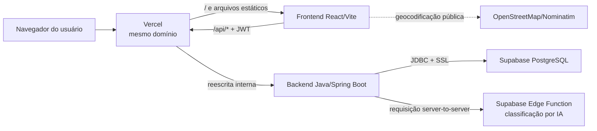

# Relatório de arquitetura e ambientes

**Projeto:** Cidadão Informa  
**Data da análise:** 28 de julho de 2026  
**Produção:** https://cidadao-informa.vercel.app

## 1. Resumo executivo

O sistema agora possui três partes bem separadas:

1. **Frontend React/Vite:** executa no navegador e apresenta as telas.
2. **Backend Java/Spring Boot:** recebe as chamadas HTTP, autentica usuários, aplica as regras de negócio e consulta o banco.
3. **Supabase/PostgreSQL:** armazena usuários, protocolos, auditoria e dados de prioridade.

O frontend **não recebe a URL do PostgreSQL, usuário, senha, chave JWT ou
configuração do Supabase**. Para dados da aplicação, ele conhece somente o
endereço público da API Java.



> A exceção às chamadas pelo Java é o serviço público de mapas:
> algumas telas chamam OpenStreetMap/Nominatim diretamente. Isso não envolve
> credenciais do banco nem dados de acesso ao Supabase.

## 2. Como uma requisição funciona em produção

Exemplo de login:

1. O usuário acessa `https://cidadao-informa.vercel.app`.
2. A Vercel entrega o frontend compilado.
3. O frontend chama `POST /api/auth/login`.
4. A regra de roteamento da Vercel envia `/api/*` ao serviço Java.
5. O Java consulta o PostgreSQL do Supabase pelo JDBC.
6. Se CPF e senha forem válidos, o Java devolve um JWT com duração de 24 horas.
7. O frontend armazena o JWT no `localStorage`.
8. Nas próximas chamadas, o frontend envia:

   ```http
   Authorization: Bearer <token>
   ```

9. O filtro de segurança do Java valida a assinatura e a validade do JWT antes
   de permitir acesso às rotas protegidas.

As senhas dos usuários são armazenadas como hash BCrypt, com fator de custo 10.
A senha original não é gravada no banco.

## 3. Roteamento na Vercel

O arquivo `vercel.json` publica dois serviços no mesmo projeto:

| Serviço | Tecnologia | Responsabilidade |
|---|---|---|
| `frontend` | Vite | HTML, CSS, JavaScript e rotas do React |
| `backend` | Container Java 21 | APIs, segurança, regras e banco |

Regras principais:

| Caminho recebido | Destino |
|---|---|
| `/api/*` | Backend Java |
| `/swagger` e `/swagger/*` | Backend Java |
| Qualquer outro caminho | Frontend Vite |

Como ambos usam o mesmo domínio, em produção o frontend usa:

```env
VITE_API_URL=/
```

O código remove a barra final e forma URLs como `/api/auth/login`. O navegador
não precisa conhecer o endereço interno do container.

### Inicialização do container Java

A Vercel exige que o container aceite conexões rapidamente. O script
`backend-java/start-vercel.sh` abre a porta pública imediatamente e encaminha o
tráfego para a porta interna `8081`, onde o Spring Boot termina de iniciar.

O primeiro acesso depois de um período sem uso pode demorar mais por causa do
**cold start** do Java e da abertura da conexão com o banco. Depois que a
instância está ativa, as chamadas são mais rápidas.

## 4. Conexão Java → Supabase

O Java usa Spring Data JPA, driver PostgreSQL e HikariCP. A configuração atual:

- usa a conexão **Session Pooler** do Supabase na porta `5432`;
- exige SSL na URL JDBC;
- mantém no máximo 3 conexões por instância Java;
- pode ficar com 0 conexões ociosas;
- executa as consultas usando os repositórios JPA;
- não utiliza `supabase-js` no frontend.

O Session Pooler é adequado ao modelo atual porque o Spring/Hibernate mantém um
pool durante a vida do container e utiliza recursos do protocolo PostgreSQL que
podem ser incompatíveis com transaction pooling.

O endpoint público:

```text
GET /api/health
```

executa `SELECT 1`. A resposta `{"status":"ok"}` confirma simultaneamente que o
container Java iniciou e que ele conseguiu acessar o PostgreSQL.

## 5. Autenticação e autorização

Rotas públicas:

- `POST /api/auth/login`
- `POST /api/auth/register`
- `GET /api/health`
- `GET /api/protocols/public/{id}`
- Swagger e documentação OpenAPI

As demais rotas exigem JWT válido. Operações administrativas também verificam o
papel `admin` no backend; não é suficiente alterar a interface ou o valor salvo
no navegador.

Cadastro, login, emissão do token e validação de sessão são realizados pelo
Java. O frontend valida uma sessão existente chamando `GET /api/auth/me`.

## 6. O que o frontend precisa

### Para executar localmente

- Node.js e npm;
- dependências instaladas pelo `package-lock.json`;
- `VITE_API_URL=http://localhost:5206`;
- API Java em execução e acessível nessa porta.

O frontend não precisa de:

- URL ou senha do PostgreSQL;
- usuário do PostgreSQL;
- `JWT_SECRET`;
- chave do Supabase;
- conexão direta com o Supabase.

Sem o backend, a landing page ainda pode abrir, mas login, cadastro, protocolos,
perfil, auditoria e prioridade não funcionarão.

### Para executar em produção

O build Vite precisa somente desta configuração pública:

```env
VITE_API_URL=/
```

Variáveis iniciadas por `VITE_` são incorporadas ao JavaScript público. Por isso
**nenhum segredo pode receber esse prefixo**.

## 7. O que o backend Java precisa

Variáveis obrigatórias:

| Variável | Ambiente | Finalidade | Vai ao navegador? |
|---|---|---|---|
| `SPRING_DATASOURCE_URL` | Local e produção | URL JDBC com SSL | Não |
| `SPRING_DATASOURCE_USERNAME` | Local e produção | Usuário do PostgreSQL | Não |
| `SPRING_DATASOURCE_PASSWORD` | Local e produção | Senha do PostgreSQL | Não |
| `JWT_SECRET` | Local e produção | Assinar e validar JWTs | Não |
| `CORS_ALLOWED_ORIGINS` | Local e produção | Origens autorizadas | Não |
| `SUPABASE_EDGE_FUNCTION_URL` | Local e produção | Classificação por IA | Não |
| `SUPABASE_ANON_KEY` | Local e produção | Autorizar chamada à Edge Function | Não |

A chave `SUPABASE_ANON_KEY` é usada pelo Java em uma chamada server-to-server.
Ela não aparece no bundle atual do frontend.

### Ajustes específicos da Vercel

| Variável | Valor de produção | Motivo |
|---|---|---|
| `SPRING_MAIN_LAZY_INITIALIZATION` | `true` | Reduzir o tempo de inicialização |
| `SPRING_DATA_JPA_REPOSITORIES_BOOTSTRAP_MODE` | `lazy` | Adiar a abertura dos repositórios |
| `SPRING_FLYWAY_ENABLED` | `false` | Evitar migrações concorrentes em cold starts |
| `SPRING_JPA_HIBERNATE_DDL_AUTO` | `none` | Não alterar o schema automaticamente |
| `APP_SCHEDULING_ENABLED` | `false` | Evitar tarefas duplicadas em instâncias escaláveis |

Na Vercel, essas variáveis estão associadas a **Production e Preview**. Alterar
uma variável não modifica um deploy já construído; é necessário fazer um novo
deploy.

## 8. Como executar tudo localmente

### Pré-requisitos

- Node.js compatível com o frontend;
- Java 21;
- Maven 3.9 ou compatível;
- acesso de rede ao Supabase.

### Passo 1 — criar o arquivo local

Na raiz do repositório:

```powershell
Copy-Item .env.example .env.local
```

Preencha `.env.local` com os valores reais. Esse arquivo é ignorado pelo Git.
Para o ambiente local, mantenha:

```env
VITE_API_URL=http://localhost:5206
CORS_ALLOWED_ORIGINS=http://localhost:3000
```

Use uma URL JDBC no seguinte formato, sem copiar este placeholder literalmente:

```env
SPRING_DATASOURCE_URL=jdbc:postgresql://<session-pooler>:5432/postgres?sslmode=require
SPRING_DATASOURCE_USERNAME=postgres.<project-ref>
SPRING_DATASOURCE_PASSWORD=<senha-do-banco>
```

O `application.yml` do Java procura `.env.local` tanto dentro de
`backend-java` quanto na raiz. Portanto, um único arquivo na raiz atende aos
dois projetos.

### Passo 2 — iniciar o Java

Em um terminal:

```powershell
Set-Location backend-java
mvn spring-boot:run
```

Endereços:

- API: http://localhost:5206
- Health: http://localhost:5206/api/health
- Swagger: http://localhost:5206/swagger

Teste:

```powershell
Invoke-RestMethod http://localhost:5206/api/health
```

### Passo 3 — iniciar o frontend

Em outro terminal, na raiz:

```powershell
npm ci
npm run dev
```

Frontend:

```text
http://localhost:3000
```

### Passo 4 — validar o fluxo

1. Abra o frontend.
2. Cadastre um usuário.
3. Faça login.
4. Confirme que o navegador chama `localhost:5206/api/...`.
5. Crie ou consulte um protocolo.
6. Verifique se o backend não mostra erro de conexão.

## 9. Como publicar em produção

Fluxo atual:

1. Alterações são commitadas no Git.
2. Um push para uma branch gera Preview.
3. O Preview deve ser validado.
4. Um push/merge na `main` inicia o deploy de Production.
5. A Vercel compila o Vite e constrói a imagem Docker do Java.
6. O domínio de produção passa a apontar para o novo deploy quando ele fica
   `READY`.

Antes de publicar:

```powershell
npm run lint
npm run build

Set-Location backend-java
mvn test
mvn package
```

Se houver alteração de schema, a migração Flyway deve ser aplicada de forma
controlada antes do deploy, pois o Flyway fica desabilitado em produção.

## 10. Segurança: o que está protegido

- `.env.local` está ignorado pelo Git.
- O frontend não contém credenciais do banco.
- A senha do PostgreSQL fica somente no ambiente do container Java.
- A senha de usuário é armazenada com BCrypt.
- JWTs são assinados pelo backend e expiram em 24 horas.
- O backend é stateless e valida o token em cada requisição.
- O acesso ao PostgreSQL usa SSL.
- As consultas de banco passam pelo Java.

### Validação realizada em produção

Na publicação analisada:

- o frontend abriu pelo domínio público;
- `GET /api/health` retornou `{"status":"ok"}`;
- uma tentativa de autenticação inválida retornou HTTP `401`;
- o bundle JavaScript público não continha senha, URL JDBC, usuário do banco,
  `JWT_SECRET`, chave Supabase ou host Supabase;
- os logs das rotas verificadas não apresentaram erro de execução.

## 11. Pontos de atenção e melhorias recomendadas

### Alta prioridade

1. **Trocar a senha do PostgreSQL.** A senha atual já foi compartilhada durante
   a configuração e deve ser rotacionada. Depois, atualizar `.env.local` e a
   variável sensível na Vercel, seguido de redeploy.
2. **Separar Preview de Production.** Atualmente os dois ambientes recebem as
   mesmas variáveis e podem atingir o mesmo banco. O ideal é usar outro projeto
   ou branch de banco para Preview.

### Média prioridade

3. **Mover o JWT para cookie HttpOnly.** O `localStorage` funciona, mas um XSS
   poderia ler o token. Cookies `HttpOnly`, `Secure` e `SameSite` reduzem esse
   risco.
4. **Desabilitar Swagger em produção** ou protegê-lo por autenticação. Ele não
   expõe senhas, mas publica o catálogo da API.
5. **Adicionar política de revogação de sessão.** Hoje um JWT válido continua
   aceito até expirar, mesmo depois de um logout local.
6. **Mover geocodificação sensível para o backend**, se futuramente os endereços
   consultados exigirem privacidade ou controle de limite.

### Operação

7. Monitorar cold starts e tempo da primeira chamada.
8. Monitorar quantidade de conexões no Supabase. Cada instância Java pode abrir
   até 3 conexões.
9. Manter migrações versionadas e aplicá-las uma única vez por release.

## 12. Diagnóstico rápido

| Sintoma | Verificação |
|---|---|
| Front abre, mas login falha localmente | Java está rodando na porta 5206? |
| Erro de CORS local | `CORS_ALLOWED_ORIGINS` contém `http://localhost:3000`? |
| `VITE_API_URL não está configurada` | A variável existe no `.env.local`? Reiniciou o Vite? |
| Senha do banco inválida | Atualizar `SPRING_DATASOURCE_PASSWORD` |
| Conexão recusada pelo banco | Conferir Session Pooler, porta 5432, usuário e rede |
| Produção continua usando valor antigo | Fazer redeploy depois de alterar variável |
| Primeira chamada demora | Verificar cold start e logs do container |
| Health retorna erro | Conferir logs Java e conexão JDBC |
| Mudança de banco não apareceu | Confirmar execução da migração Flyway |

## 13. Arquivos que são fonte da verdade

| Arquivo | O que define |
|---|---|
| `.env.example` | Lista segura de variáveis necessárias |
| `src/services/http.ts` | Montagem da URL e envio do JWT |
| `src/services/api.ts` | Contrato usado pelo frontend |
| `src/context/AppContext.tsx` | Sessão no navegador |
| `vercel.json` | Serviços e roteamento de produção |
| `backend-java/src/main/resources/application.yml` | Portas, banco, JPA e variáveis Java |
| `backend-java/.../SecurityConfig.java` | Rotas públicas, JWT e CORS |
| `backend-java/Dockerfile.vercel` | Imagem Java de produção |
| `backend-java/start-vercel.sh` | Inicialização e encaminhamento interno |
| `backend-java/src/main/resources/db/migration/` | Evolução do schema |

## 14. Observação sobre mudanças recentes do Supabase

O Supabase está alterando a exposição automática de tabelas na Data API. Essa
mudança não afeta o fluxo principal atual, porque o sistema usa JDBC/JPA pelo
backend Java, e não a Data API pelo navegador. Mesmo assim, tabelas expostas no
schema `public` devem continuar protegidas com permissões e RLS como defesa em
profundidade.

## 15. Referências oficiais

- Vercel — Environment Variables: https://vercel.com/docs/environment-variables
- Vercel — Services: https://vercel.com/docs/services
- Supabase — Conexão com PostgreSQL: https://supabase.com/docs/guides/database/connecting-to-postgres
- Supabase — Segurança da Data API: https://supabase.com/docs/guides/api/securing-your-api
- Supabase — Mudança na exposição de tabelas: https://supabase.com/changelog/45329-breaking-change-tables-not-exposed-to-data-and-graphql-api-automatically
