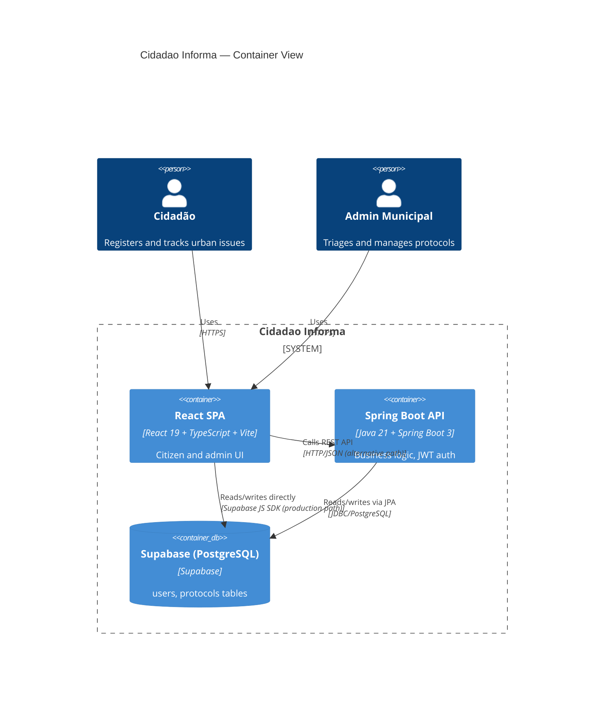

# Architecture

> C4 Container diagram of the Cidadao Informa system.

## Container Diagram

## Two API Paths

The frontend has **two parallel API integration paths**:

| Path | Used For | Notes |
|------|----------|-------|
| `src/services/api.ts` → Supabase JS SDK | Production (Vercel deploy) | Direct DB access, session tokens stored in localStorage |
| `backend-java` Spring Boot API | Academic/local | JWT-signed tokens, Clean Architecture layers |

## Related

- [[Project Overview]]
- [[Tech Stack]]
- [[Data Flow]]
- [[Infrastructure Overview]]
