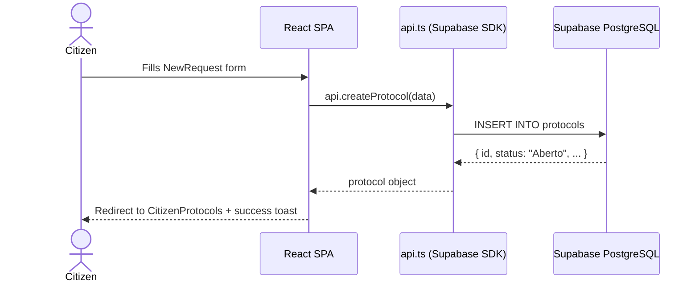

# Data Flow

> End-to-end sequence for the most common user action: opening a new solicitação.

## New Protocol — Sequence Diagram

## Authentication Flow (summary)

See [[Login Flow]] and [[Register Flow]] for detailed sequences.

## Related

- [[Architecture]]
- [[Login Flow]]
- [[Register Flow]]
- [[Protocol Lifecycle]]
- [[API Overview]]
