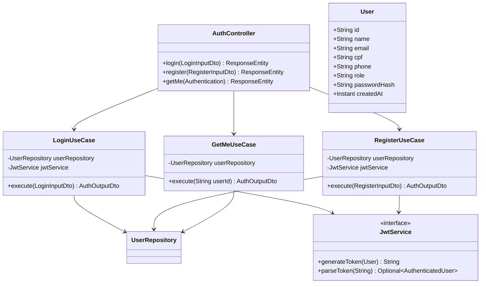

# Auth Domain

> Handles user registration, login, JWT issuance, and profile retrieval for both citizen and admin roles.

## Class Diagram

## Notes in This Domain

- [[AuthController]]
- [[LoginUseCase]]
- [[RegisterUseCase]]
- [[GetMeUseCase]]
- [[JwtService]]
- [[User Entity]]
- [[LoginInputDto]]
- [[RegisterInputDto]]
- [[AuthOutputDto]]
- [[Login Flow]]
- [[Register Flow]]

## Related Domains

- [[Protocol Domain]] (protocols are owned by authenticated users)
- [[API Overview]] → [[Auth Endpoints]]
- [[Infrastructure Overview]] → [[Supabase]] (user persistence)
