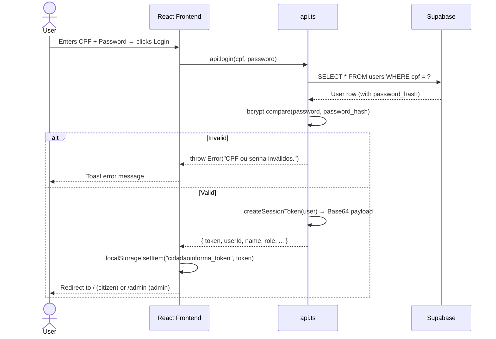
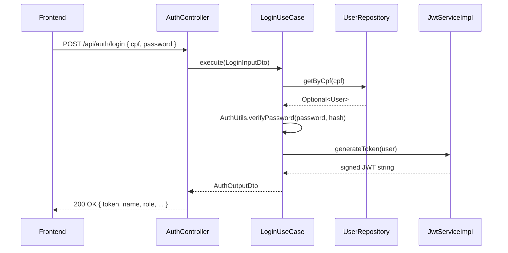

# Login Flow

> Sequence for authenticating a user via CPF + password.

## Production Path (Supabase JS SDK)

## Spring Boot Path (academic/local)

## Session Storage

The frontend stores a **Base64-encoded session token** (not a signed JWT) in `localStorage` under the key `cidadaoinforma_token`. This is decoded by `decodeSessionToken()` in `api.ts` for subsequent calls.

## Related

- [[Auth Domain]]
- [[AuthController]]
- [[LoginUseCase]]
- [[JwtService]]
- [[User Entity]]
- [[LoginInputDto]] → [[AuthOutputDto]]
- [[Supabase]]
