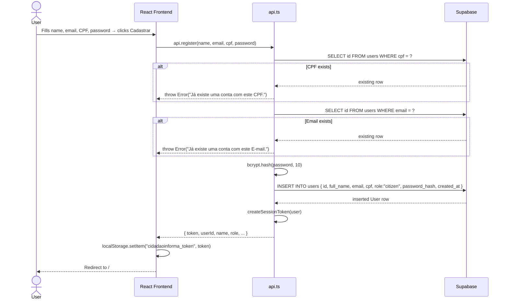

# Register Flow

> Sequence for registering a new citizen account.

## Production Path (Supabase JS SDK)

## Validations (Spring Boot path)

`RegisterUseCase` enforces these rules before persisting:

| Field | Rule |
|-------|------|
| name | non-blank |
| cpf | exactly 11 digits |
| email | contains `@`, normalized to lowercase |
| password | minimum 6 characters |
| cpf | unique in database |
| email | unique in database |

## Related

- [[Auth Domain]]
- [[AuthController]]
- [[RegisterUseCase]]
- [[User Entity]]
- [[RegisterInputDto]] → [[AuthOutputDto]]
- [[Supabase]]
