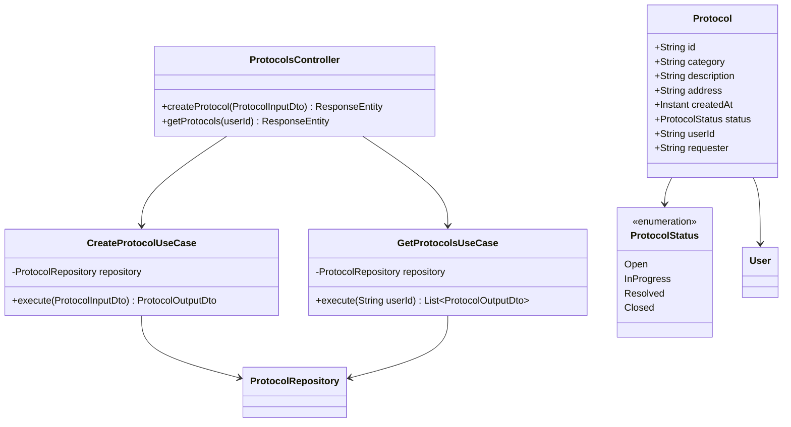

# Protocol Domain

> Manages the full lifecycle of citizen service requests (solicitações/protocolos) from creation to closure.

## Class Diagram

## Notes in This Domain

- [[ProtocolsController]]
- [[CreateProtocolUseCase]]
- [[GetProtocolsUseCase]]
- [[Protocol Entity]]
- [[ProtocolInputDto]]
- [[ProtocolOutputDto]]
- [[Protocol Lifecycle]]

## Related Domains

- [[Auth Domain]] (protocols belong to [[User Entity]])
- [[Admin Domain]] (admins manage the queue)
- [[Citizen Domain]] (citizens create and track protocols)
- [[API Overview]] → [[Protocol Endpoints]]
