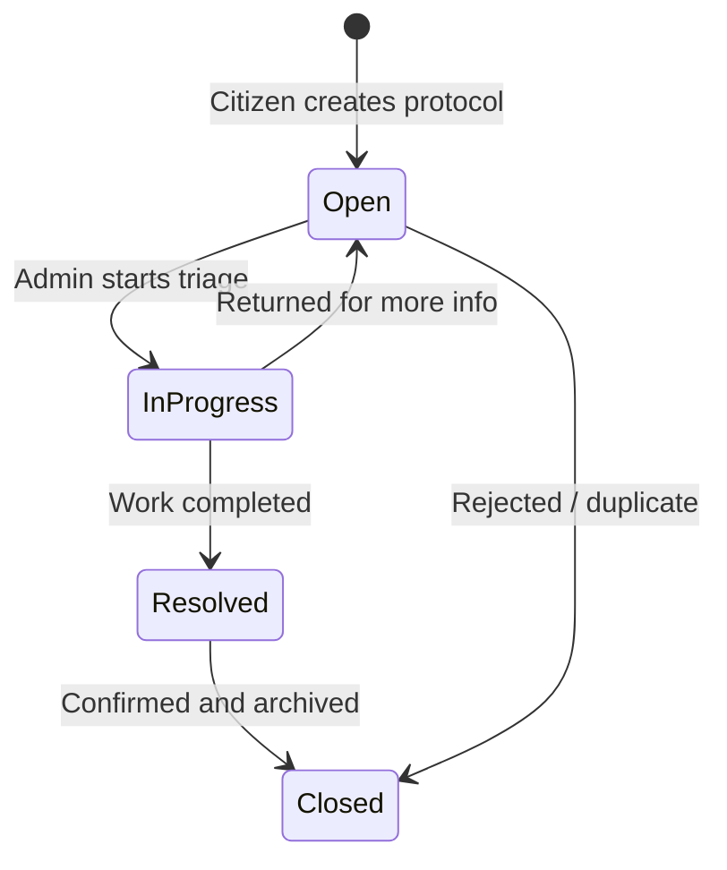

# Protocol Lifecycle

> State machine for a protocol (solicitação) from opening to closure.

## State Diagram

## Status Labels

| Enum Value | PT-BR label | Meaning |
|-----------|-------------|---------|
| `Open` | Aberto | Just created, awaiting triage |
| `InProgress` | Em Análise | Admin is working on it |
| `Resolved` | Concluído | Resolution applied |
| `Closed` | Fechado | Archived |

## Frontend Status Labels

The frontend `api.ts` uses Portuguese strings (`"Aberto"`, `"Em Análise"`, `"Concluído"`, `"Atrasado"`) which differ slightly from the backend enum. `"Atrasado"` (late) is a frontend-only derived state — not stored in the database.

## Code Reference

`backend-java/src/main/java/br/com/fiap/hackgov/domain/enums/ProtocolStatus.java`

## Related

- [[Protocol Domain]]
- [[Protocol Entity]]
- [[AdminRequestsQueue]]
- [[CitizenProtocols]]
