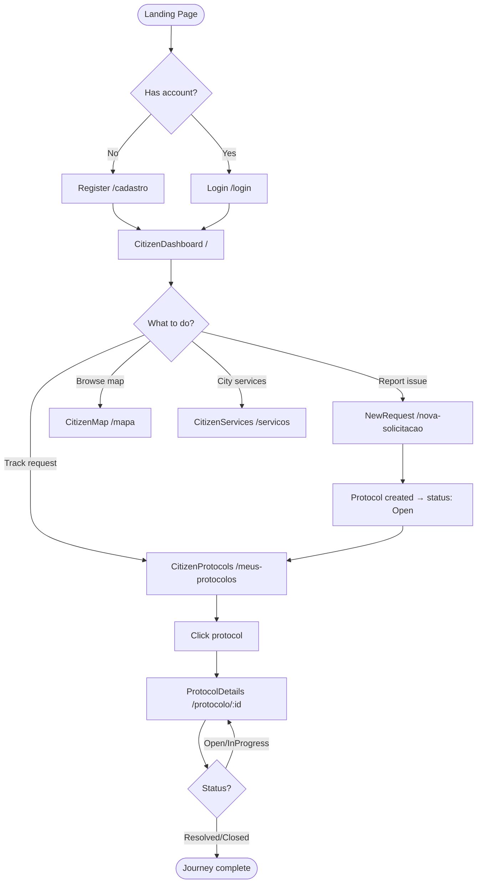

# Citizen Journey

> End-to-end flowchart of the citizen experience from landing to protocol resolution.

## Flowchart

## Public Protocol

Any protocol can also be tracked without login via `/p/:id` (PublicProtocol page).

## Related

- [[Citizen Domain]]
- [[NewRequest]]
- [[CitizenProtocols]]
- [[Protocol Lifecycle]]
- [[Login Flow]]
- [[Register Flow]]
