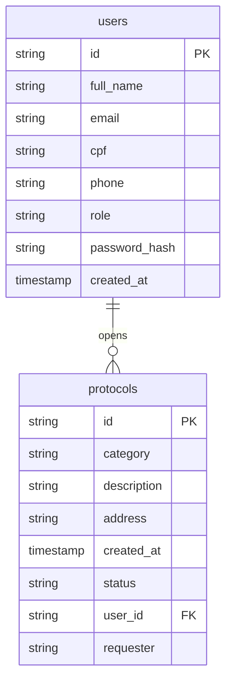

# Database Schema

> Entity-Relationship diagram for the Supabase PostgreSQL database.

## ER Diagram

## Status Values

See [[Protocol Lifecycle]] for the full state machine. Status is stored as a plain string in the `protocols` table (e.g., `"Open"`, `"InProgress"`, `"Resolved"`, `"Closed"`).

## Related

- [[Infrastructure Overview]]
- [[Supabase]]
- [[User Entity]]
- [[Protocol Entity]]
