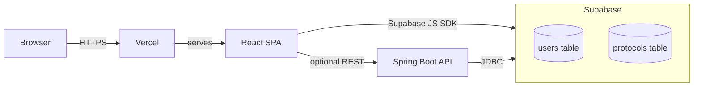

# Infrastructure Overview

> Hosting, database, and runtime infrastructure for Cidadao Informa.

## Diagram

## Notes in This Domain

- [[Supabase]]
- [[Database Schema]]
- [[Environment Variables]]
- [[Deploy]]

## Related

- [[Architecture]]
- [[Tech Stack]]
