# Obsidian Documentation Implementation Plan

> **For agentic workers:** REQUIRED SUB-SKILL: Use superpowers:subagent-driven-development (recommended) or superpowers:executing-plans to implement this plan task-by-task. Steps use checkbox (`- [ ]`) syntax for tracking.

**Goal:** Create ~35 rich, interlinked Markdown notes covering every layer of the Cidadao Informa project, optimized for Obsidian's graph view and AI context ingestion.

**Architecture:** Hub + Spoke hybrid — each domain folder has one hub note that links to all child notes; child notes link back to the hub and cross-reference related notes in other domains. Every note includes YAML frontmatter with tags/aliases, wiki-links, and Mermaid diagrams where applicable.

**Tech Stack:** Markdown, Mermaid, Obsidian wiki-links (`[[Note Name]]`), YAML frontmatter

---

## Task 1: 00-overview — Project Overview (hub root)

**Files:**
- Create: `docs/00-overview/Project Overview.md`

- [ ] **Step 1: Create the file**

```markdown
---
tags: [type/hub, domain/overview]
aliases: [Home, Index, Root]
---

# Project Overview

> Cidadao Informa is a digital urban-maintenance platform that lets citizens report city issues and track their resolution, while giving city administrators triage dashboards, maps, and reports.

## What It Is

A full-stack civic-tech application built for the HackGov/FIAP hackathon. Citizens open *solicitações* (service requests) for urban problems — potholes, broken street lights, illegal dumping — and follow their protocol through a public tracking page. Administrators manage the queue, view a heat-map, and export reports.

## Domain Map

- [[Auth Domain]] — registration, login, JWT, user profile
- [[Protocol Domain]] — solicitações lifecycle from Open to Closed
- [[Admin Domain]] — dashboard, queue, map, reports for city staff
- [[Citizen Domain]] — citizen-facing pages and journey
- [[Infrastructure Overview]] — Supabase, database schema, deploy
- [[API Overview]] — REST endpoints and contracts

## Architecture

[[Architecture]] — C4 container diagram

## Data Flow

[[Data Flow]] — end-to-end request sequence diagram

## Tech Stack

[[Tech Stack]] — full technology table
```

- [ ] **Step 2: Commit**

```bash
git add docs/00-overview/"Project Overview.md"
git commit -m "docs: add Project Overview hub note"
```

---

## Task 2: 00-overview — Architecture

**Files:**
- Create: `docs/00-overview/Architecture.md`

- [ ] **Step 1: Create the file**

```markdown
---
tags: [type/diagram, domain/overview, layer/architecture]
aliases: [C4, System Architecture, Arquitetura]
---

# Architecture

> C4 Container diagram of the Cidadao Informa system.

## Container Diagram

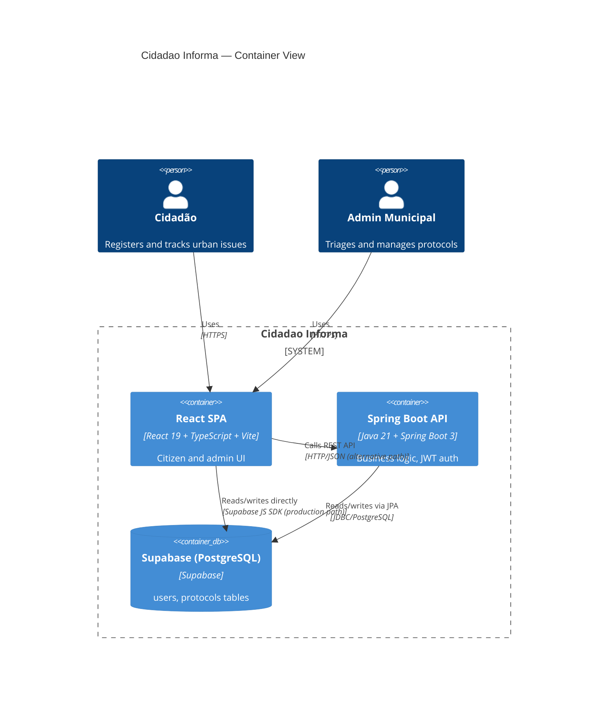

## Two API Paths

The frontend has **two parallel API integration paths**:

| Path | Used For | Notes |
|------|----------|-------|
| `src/services/api.ts` → Supabase JS SDK | Production (Vercel deploy) | Direct DB access, session tokens stored in localStorage |
| `backend-java` Spring Boot API | Academic/local | JWT-signed tokens, Clean Architecture layers |

## Related

- [[Project Overview]]
- [[Tech Stack]]
- [[Data Flow]]
- [[Infrastructure Overview]]
```

- [ ] **Step 2: Commit**

```bash
git add docs/00-overview/Architecture.md
git commit -m "docs: add Architecture C4 diagram note"
```

---

## Task 3: 00-overview — Tech Stack & Data Flow

**Files:**
- Create: `docs/00-overview/Tech Stack.md`
- Create: `docs/00-overview/Data Flow.md`

- [ ] **Step 1: Create Tech Stack.md**

```markdown
---
tags: [type/diagram, domain/overview]
aliases: [Stack, Technologies, Tecnologias]
---

# Tech Stack

> Full technology inventory for Cidadao Informa.

## Frontend

| Technology | Version | Purpose |
|-----------|---------|---------|
| React | 19 | UI framework |
| TypeScript | 5.x | Type safety |
| Vite | 6.x | Build tool + dev server |
| React Router | 7.x | Client-side routing |
| Tailwind CSS | 4.x | Utility-first styling |
| Leaflet / React-Leaflet | — | Interactive maps |
| Recharts | — | Admin charts and reports |
| Supabase JS | 2.x | Direct DB client (production) |
| bcryptjs | — | Password hashing in browser |

## Backend (Spring Boot)

| Technology | Purpose |
|-----------|---------|
| Java 21 | Runtime |
| Spring Boot 3 | Web framework |
| Spring Security | JWT filter chain |
| JPA / Hibernate | ORM |
| PostgreSQL | Database |
| JJWT | JWT generation and parsing |
| SpringDoc OpenAPI | Swagger UI |

## Infrastructure

| Service | Purpose |
|---------|---------|
| Supabase | Hosted PostgreSQL + anonymous API key |
| Vercel | Frontend deploy (static SPA) |

## Related

- [[Architecture]]
- [[Infrastructure Overview]]
- [[Supabase]]
```

- [ ] **Step 2: Create Data Flow.md**

```markdown
---
tags: [type/diagram, domain/overview]
aliases: [Request Flow, Sequence, Fluxo de Dados]
---

# Data Flow

> End-to-end sequence for the most common user action: opening a new solicitação.

## New Protocol — Sequence Diagram

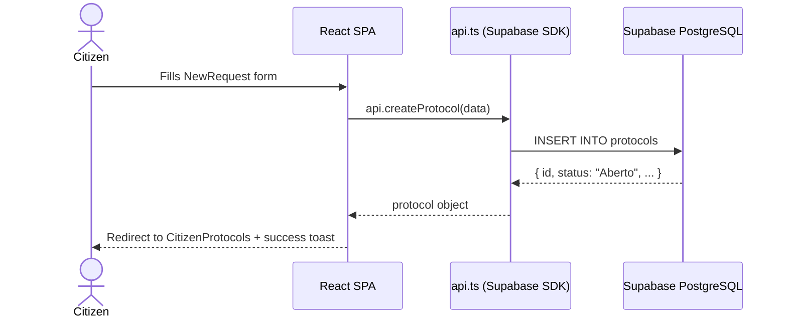

## Authentication Flow (summary)

See [[Login Flow]] and [[Register Flow]] for detailed sequences.

## Related

- [[Architecture]]
- [[Login Flow]]
- [[Register Flow]]
- [[Protocol Lifecycle]]
- [[API Overview]]
```

- [ ] **Step 3: Commit**

```bash
git add docs/00-overview/"Tech Stack.md" docs/00-overview/"Data Flow.md"
git commit -m "docs: add Tech Stack and Data Flow notes"
```

---

## Task 4: 01-auth — Auth Domain hub

**Files:**
- Create: `docs/01-auth/Auth Domain.md`

- [ ] **Step 1: Create the file**

```markdown
---
tags: [type/hub, domain/auth]
aliases: [Authentication, Autenticação, Auth]
---

# Auth Domain

> Handles user registration, login, JWT issuance, and profile retrieval for both citizen and admin roles.

## Class Diagram

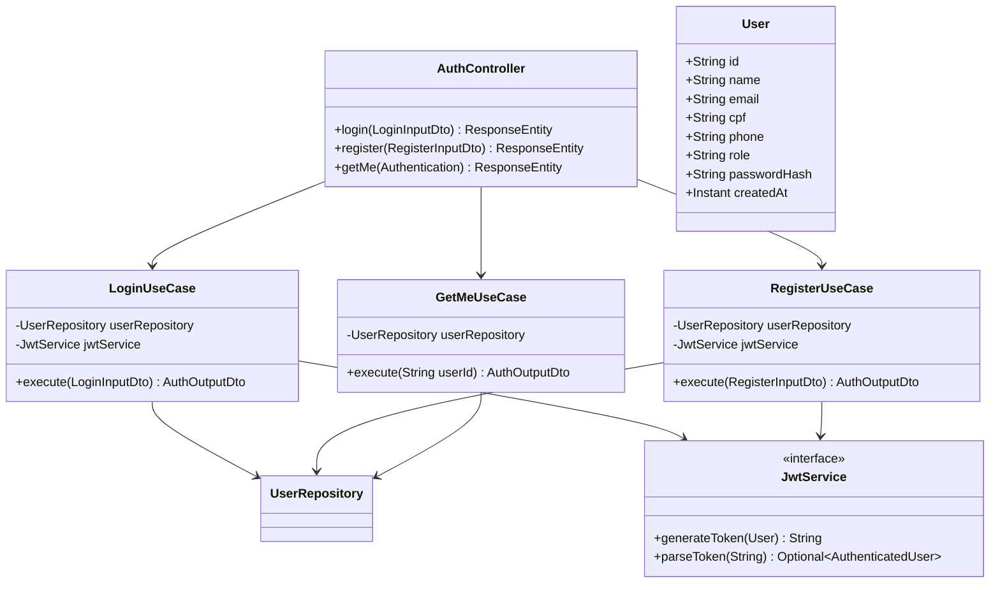

## Notes in This Domain

- [[AuthController]]
- [[LoginUseCase]]
- [[RegisterUseCase]]
- [[GetMeUseCase]]
- [[JwtService]]
- [[User Entity]]
- [[LoginInputDto]]
- [[RegisterInputDto]]
- [[AuthOutputDto]]
- [[Login Flow]]
- [[Register Flow]]

## Related Domains

- [[Protocol Domain]] (protocols are owned by authenticated users)
- [[API Overview]] → [[Auth Endpoints]]
- [[Infrastructure Overview]] → [[Supabase]] (user persistence)
```

- [ ] **Step 2: Commit**

```bash
git add docs/01-auth/"Auth Domain.md"
git commit -m "docs: add Auth Domain hub note"
```

---

## Task 5: 01-auth — Login and Register Flows

**Files:**
- Create: `docs/01-auth/Login Flow.md`
- Create: `docs/01-auth/Register Flow.md`

- [ ] **Step 1: Create Login Flow.md**

```markdown
---
tags: [type/flow, domain/auth, layer/backend]
aliases: [Login Sequence, Fluxo de Login]
---

# Login Flow

> Sequence for authenticating a user via CPF + password.

## Sequence Diagram

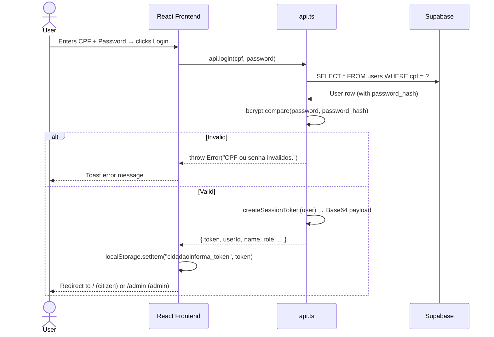

## Spring Boot Path (alternative)

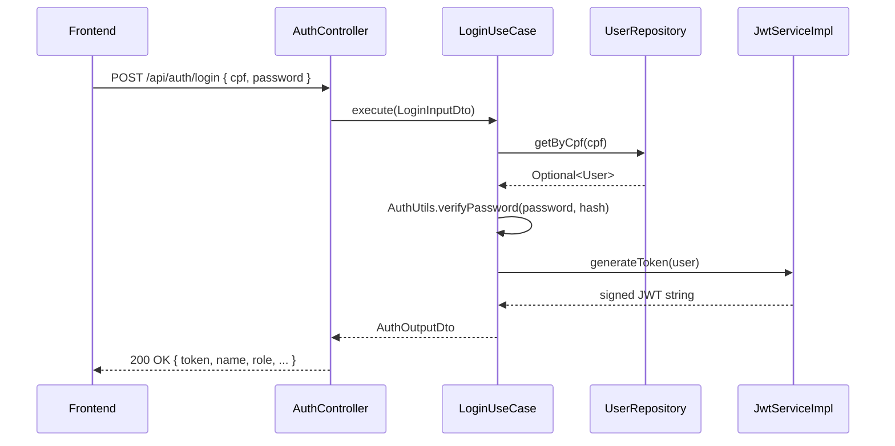

## Session Storage

The frontend stores a **Base64-encoded session token** (not a signed JWT) in `localStorage` under the key `cidadaoinforma_token`. This is decoded by `decodeSessionToken()` in `api.ts` for subsequent calls.

## Related

- [[Auth Domain]]
- [[AuthController]]
- [[LoginUseCase]]
- [[JwtService]]
- [[User Entity]]
- [[LoginInputDto]] → [[AuthOutputDto]]
- [[Supabase]]
```

- [ ] **Step 2: Create Register Flow.md**

```markdown
---
tags: [type/flow, domain/auth, layer/backend]
aliases: [Registration Sequence, Fluxo de Cadastro]
---

# Register Flow

> Sequence for registering a new citizen account.

## Sequence Diagram

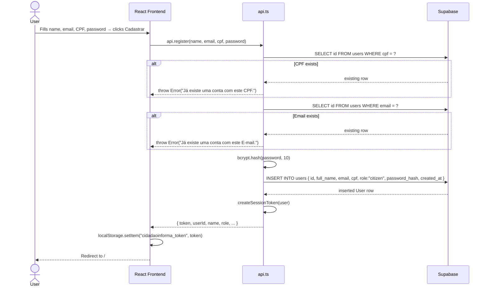

## Validations (Spring Boot path)

`RegisterUseCase` enforces these rules before persisting:

| Field | Rule |
|-------|------|
| name | non-blank |
| cpf | exactly 11 digits |
| email | contains `@`, normalized to lowercase |
| password | minimum 6 characters |
| cpf | unique in database |
| email | unique in database |

## Related

- [[Auth Domain]]
- [[AuthController]]
- [[RegisterUseCase]]
- [[User Entity]]
- [[RegisterInputDto]] → [[AuthOutputDto]]
- [[Supabase]]
```

- [ ] **Step 3: Commit**

```bash
git add docs/01-auth/"Login Flow.md" docs/01-auth/"Register Flow.md"
git commit -m "docs: add Login Flow and Register Flow sequence diagrams"
```

---

## Task 6: 01-auth — Controllers, Use Cases, DTOs

**Files:**
- Create: `docs/01-auth/AuthController.md`
- Create: `docs/01-auth/LoginUseCase.md`
- Create: `docs/01-auth/RegisterUseCase.md`
- Create: `docs/01-auth/GetMeUseCase.md`
- Create: `docs/01-auth/JwtService.md`
- Create: `docs/01-auth/User Entity.md`

- [ ] **Step 1: Create AuthController.md**

```markdown
---
tags: [domain/auth, layer/backend, layer/api, type/controller]
aliases: [Auth Controller, /api/auth]
---

# AuthController

> REST controller that exposes the three auth endpoints under `/api/auth`.

## Responsibility

Receives HTTP requests, delegates to use cases, and wraps responses in `ResponseEntity`. All error handling is catch-and-return (no global exception handler).

## Endpoints

| Method | Path | Use Case | Auth Required |
|--------|------|----------|--------------|
| POST | `/api/auth/login` | [[LoginUseCase]] | No |
| POST | `/api/auth/register` | [[RegisterUseCase]] | No |
| GET | `/api/auth/me` | [[GetMeUseCase]] | Yes (JWT) |

## Dependencies

- [[LoginUseCase]]
- [[RegisterUseCase]]
- [[GetMeUseCase]]
- `AuthenticatedUser` (Spring Security principal record)

## Code Reference

`backend-java/src/main/java/br/com/fiap/hackgov/api/controller/AuthController.java`

## Related

- [[Auth Domain]]
- [[Auth Endpoints]]
- [[Login Flow]]
- [[Register Flow]]
```

- [ ] **Step 2: Create LoginUseCase.md**

```markdown
---
tags: [domain/auth, layer/backend, type/usecase]
aliases: [Login Use Case, Caso de Uso de Login]
---

# LoginUseCase

> Authenticates a user by CPF and password, returning a signed JWT and profile data.

## Responsibility

Looks up the user by CPF, verifies the bcrypt hash, generates a JWT token, and returns `AuthOutputDto`.

## Dependencies

- [[User Entity]] via `UserRepository.getByCpf()`
- [[JwtService]] → `generateToken()`
- `AuthUtils.verifyPassword()` (bcrypt comparison)
- [[LoginInputDto]] → [[AuthOutputDto]]

## Key Logic

```java
User user = userRepository.getByCpf(input.cpf())
        .orElseThrow(() -> new IllegalArgumentException("CPF ou senha inválidos."));

if (!AuthUtils.verifyPassword(input.password(), user.getPasswordHash())) {
    throw new IllegalArgumentException("CPF ou senha inválidos.");
}

String token = jwtService.generateToken(user);
return new AuthOutputDto(token, user.getName(), user.getEmail(), ...);
```

## Code Reference

`backend-java/src/main/java/br/com/fiap/hackgov/application/usecase/auth/LoginUseCase.java`

## Related

- [[Auth Domain]]
- [[AuthController]]
- [[Login Flow]]
- [[JwtService]]
```

- [ ] **Step 3: Create RegisterUseCase.md**

```markdown
---
tags: [domain/auth, layer/backend, type/usecase]
aliases: [Register Use Case, Caso de Uso de Cadastro]
---

# RegisterUseCase

> Validates and persists a new citizen account, returning a signed JWT on success.

## Responsibility

Runs field-level validations, checks CPF/email uniqueness, hashes the password, persists the user, and returns a JWT.

## Validations

| Field | Rule |
|-------|------|
| name | non-blank |
| cpf | exactly 11 digits |
| email | contains `@`, normalized to lowercase |
| password | min 6 characters |
| cpf | unique |
| email | unique |

## Dependencies

- [[User Entity]] via `UserRepository.add()`
- [[JwtService]] → `generateToken()`
- `AuthUtils.hashPassword()` (bcrypt)
- [[RegisterInputDto]] → [[AuthOutputDto]]

## Code Reference

`backend-java/src/main/java/br/com/fiap/hackgov/application/usecase/auth/RegisterUseCase.java`

## Related

- [[Auth Domain]]
- [[AuthController]]
- [[Register Flow]]
```

- [ ] **Step 4: Create GetMeUseCase.md**

```markdown
---
tags: [domain/auth, layer/backend, type/usecase]
aliases: [GetMe, Meu Perfil]
---

# GetMeUseCase

> Returns the profile of the currently authenticated user by their userId extracted from the JWT.

## Responsibility

Looks up the user by ID and returns their data. Returns an `AuthOutputDto` with an empty token field (token is not re-issued on `/me`).

## Dependencies

- [[User Entity]] via `UserRepository.getById()`
- [[AuthOutputDto]]

## Code Reference

`backend-java/src/main/java/br/com/fiap/hackgov/application/usecase/auth/GetMeUseCase.java`

## Related

- [[Auth Domain]]
- [[AuthController]]
- [[User Entity]]
```

- [ ] **Step 5: Create JwtService.md**

```markdown
---
tags: [domain/auth, layer/backend, type/service]
aliases: [JWT, Token Service, Serviço JWT]
---

# JwtService

> Interface for JWT generation and parsing. Implemented by `JwtServiceImpl` in the infrastructure layer.

## Responsibility

Abstracts token issuance and validation so use cases depend on the interface, not the JJWT library directly.

## Interface

```java
public interface JwtService {
    String generateToken(User user);
    Optional<AuthenticatedUser> parseToken(String token);
}
```

## Implementation

`JwtServiceImpl` (infrastructure layer) uses the JJWT library. The JWT payload includes `userId` which is extracted by `JwtAuthenticationFilter` and set as the Spring Security principal (`AuthenticatedUser` record).

## Code Reference

- Interface: `backend-java/src/main/java/br/com/fiap/hackgov/application/service/JwtService.java`
- Impl: `backend-java/src/main/java/br/com/fiap/hackgov/infrastructure/service/JwtServiceImpl.java`
- Filter: `backend-java/src/main/java/br/com/fiap/hackgov/infrastructure/security/JwtAuthenticationFilter.java`

## Related

- [[Auth Domain]]
- [[LoginUseCase]]
- [[RegisterUseCase]]
- [[Login Flow]]
```

- [ ] **Step 6: Create User Entity.md**

```markdown
---
tags: [domain/auth, layer/database, type/entity]
aliases: [User, Usuário, users table]
---

# User Entity

> JPA entity mapped to the `users` table in Supabase PostgreSQL.

## Fields

| Column | Type | Nullable | Notes |
|--------|------|----------|-------|
| `id` | String (UUID) | No | Auto-generated via `@PrePersist` |
| `full_name` | String | No | Maps to Java field `name` |
| `email` | String | No | Normalized to lowercase on save |
| `cpf` | String | No | 11-digit Brazilian tax ID |
| `phone` | String | Yes | Added for WhatsApp admin contact |
| `role` | String | No | `"citizen"` (default) or `"admin"` |
| `password_hash` | String | No | bcrypt hash |
| `created_at` | Instant | No | Set by `@PrePersist` |

## Relationships

- One-to-many with [[Protocol Entity]] via `userId`

## Code Reference

`backend-java/src/main/java/br/com/fiap/hackgov/domain/entity/User.java`

## Related

- [[Auth Domain]]
- [[Database Schema]]
- [[Supabase]]
- [[Protocol Entity]]
```

- [ ] **Step 7: Commit**

```bash
git add docs/01-auth/
git commit -m "docs: add auth controllers, use cases, JwtService and User Entity notes"
```

---

## Task 7: 01-auth — DTOs

**Files:**
- Create: `docs/01-auth/LoginInputDto.md`
- Create: `docs/01-auth/RegisterInputDto.md`
- Create: `docs/01-auth/AuthOutputDto.md`

- [ ] **Step 1: Create all three DTO notes**

**LoginInputDto.md:**
```markdown
---
tags: [domain/auth, layer/api, type/dto]
aliases: [Login Input, Login Payload]
---

# LoginInputDto

> Input payload for `POST /api/auth/login`.

## Shape

```java
record LoginInputDto(String cpf, String password) {}
```

| Field | Type | Description |
|-------|------|-------------|
| cpf | String | 11-digit CPF (no formatting) |
| password | String | Plain-text password (hashed server-side) |

## Related

- [[Auth Domain]]
- [[LoginUseCase]]
- [[AuthController]]
- [[Auth Endpoints]]
```

**RegisterInputDto.md:**
```markdown
---
tags: [domain/auth, layer/api, type/dto]
aliases: [Register Input, Cadastro Payload]
---

# RegisterInputDto

> Input payload for `POST /api/auth/register`.

## Shape

```java
record RegisterInputDto(String name, String email, String cpf, String password) {}
```

| Field | Type | Validation |
|-------|------|-----------|
| name | String | non-blank |
| email | String | contains `@`, lowercased |
| cpf | String | exactly 11 digits, unique |
| password | String | min 6 chars |

## Related

- [[Auth Domain]]
- [[RegisterUseCase]]
- [[AuthController]]
- [[Auth Endpoints]]
```

**AuthOutputDto.md:**
```markdown
---
tags: [domain/auth, layer/api, type/dto]
aliases: [Auth Response, Auth Output, Login Response]
---

# AuthOutputDto

> Unified output payload returned by login, register, and getMe endpoints.

## Shape

```java
record AuthOutputDto(
    String token,
    String name,
    String email,
    String cpf,
    String role,
    String userId,
    Instant createdAt
) {}
```

## Notes

- `token` is an empty string `""` when returned by `GetMeUseCase` (not re-issued on `/me`)
- `role` is either `"citizen"` or `"admin"` — drives routing in the frontend [[App.tsx]]

## Related

- [[Auth Domain]]
- [[LoginUseCase]]
- [[RegisterUseCase]]
- [[GetMeUseCase]]
- [[Auth Endpoints]]
```

- [ ] **Step 2: Commit**

```bash
git add docs/01-auth/"LoginInputDto.md" docs/01-auth/"RegisterInputDto.md" docs/01-auth/"AuthOutputDto.md"
git commit -m "docs: add auth DTO notes"
```

---

## Task 8: 02-protocols — Protocol Domain hub + Lifecycle

**Files:**
- Create: `docs/02-protocols/Protocol Domain.md`
- Create: `docs/02-protocols/Protocol Lifecycle.md`

- [ ] **Step 1: Create Protocol Domain.md**

```markdown
---
tags: [type/hub, domain/protocols]
aliases: [Protocols, Solicitações, Protocolos]
---

# Protocol Domain

> Manages the full lifecycle of citizen service requests (solicitações/protocolos) from creation to closure.

## Class Diagram

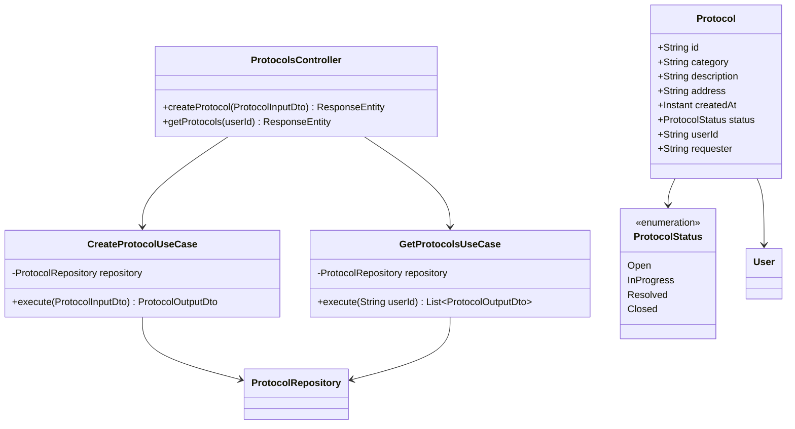

## Notes in This Domain

- [[ProtocolsController]]
- [[CreateProtocolUseCase]]
- [[GetProtocolsUseCase]]
- [[Protocol Entity]]
- [[ProtocolInputDto]]
- [[ProtocolOutputDto]]
- [[Protocol Lifecycle]]

## Related Domains

- [[Auth Domain]] (protocols belong to [[User Entity]])
- [[Admin Domain]] (admins manage the queue)
- [[Citizen Domain]] (citizens create and track protocols)
- [[API Overview]] → [[Protocol Endpoints]]
```

- [ ] **Step 2: Create Protocol Lifecycle.md**

```markdown
---
tags: [type/flow, domain/protocols, type/diagram]
aliases: [Protocol Status, Status Machine, Lifecycle]
---

# Protocol Lifecycle

> State machine for a protocol (solicitação) from opening to closure.

## State Diagram

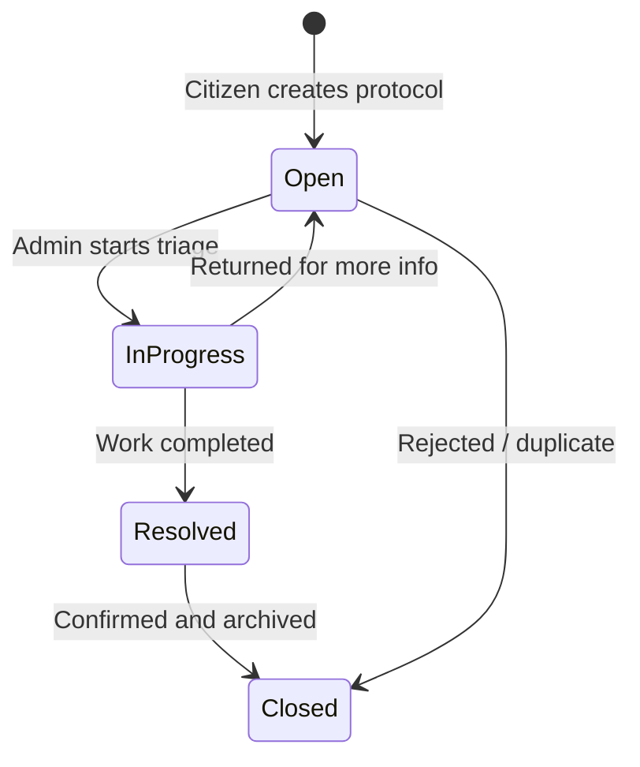

## Status Labels

| Enum Value | PT-BR label | Meaning |
|-----------|-------------|---------|
| `Open` | Aberto | Just created, awaiting triage |
| `InProgress` | Em Análise | Admin is working on it |
| `Resolved` | Concluído | Resolution applied |
| `Closed` | Fechado | Archived |

## Frontend Status Labels

The frontend `api.ts` uses Portuguese strings (`"Aberto"`, `"Em Análise"`, `"Concluído"`, `"Atrasado"`) which differ slightly from the backend enum. `"Atrasado"` (late) is a frontend-only derived state — not stored in the database.

## Code Reference

`backend-java/src/main/java/br/com/fiap/hackgov/domain/enums/ProtocolStatus.java`

## Related

- [[Protocol Domain]]
- [[Protocol Entity]]
- [[AdminRequestsQueue]]
- [[CitizenProtocols]]
```

- [ ] **Step 3: Commit**

```bash
git add docs/02-protocols/"Protocol Domain.md" docs/02-protocols/"Protocol Lifecycle.md"
git commit -m "docs: add Protocol Domain hub and Lifecycle state machine"
```

---

## Task 9: 02-protocols — Controller, Use Cases, Entity, DTOs

**Files:**
- Create: `docs/02-protocols/ProtocolsController.md`
- Create: `docs/02-protocols/CreateProtocolUseCase.md`
- Create: `docs/02-protocols/GetProtocolsUseCase.md`
- Create: `docs/02-protocols/Protocol Entity.md`
- Create: `docs/02-protocols/ProtocolInputDto.md`
- Create: `docs/02-protocols/ProtocolOutputDto.md`

- [ ] **Step 1: Create ProtocolsController.md**

```markdown
---
tags: [domain/protocols, layer/backend, layer/api, type/controller]
aliases: [Protocol Controller, /api/protocols]
---

# ProtocolsController

> REST controller that exposes protocol endpoints under `/api/protocols`.

## Endpoints

| Method | Path | Use Case | Auth |
|--------|------|----------|------|
| POST | `/api/protocols` | [[CreateProtocolUseCase]] | Yes |
| GET | `/api/protocols?userId=` | [[GetProtocolsUseCase]] | Yes |

The `userId` query param on GET is optional. If omitted, all protocols are returned (admin use case). If provided, only that user's protocols are returned (citizen use case).

## Code Reference

`backend-java/src/main/java/br/com/fiap/hackgov/api/controller/ProtocolsController.java`

## Related

- [[Protocol Domain]]
- [[Protocol Endpoints]]
- [[CreateProtocolUseCase]]
- [[GetProtocolsUseCase]]
```

- [ ] **Step 2: Create CreateProtocolUseCase.md**

```markdown
---
tags: [domain/protocols, layer/backend, type/usecase]
aliases: [Create Protocol, Nova Solicitação Use Case]
---

# CreateProtocolUseCase

> Persists a new protocol/solicitação and returns its output representation.

## Responsibility

Maps `ProtocolInputDto` to a `Protocol` entity, saves it, and returns `ProtocolOutputDto`. The `status` defaults to `Open` and `id` to a new UUID via `@PrePersist`.

## Dependencies

- [[Protocol Entity]] via `ProtocolRepository.add()`
- [[ProtocolInputDto]] → [[ProtocolOutputDto]]

## Code Reference

`backend-java/src/main/java/br/com/fiap/hackgov/application/usecase/protocol/CreateProtocolUseCase.java`

## Related

- [[Protocol Domain]]
- [[ProtocolsController]]
- [[Data Flow]]
```

- [ ] **Step 3: Create GetProtocolsUseCase.md**

```markdown
---
tags: [domain/protocols, layer/backend, type/usecase]
aliases: [Get Protocols, List Protocols]
---

# GetProtocolsUseCase

> Returns a list of protocols, filtered by userId if provided, otherwise all protocols.

## Responsibility

Delegates to `ProtocolRepository.getByUserId()` or `getAll()` depending on whether `userId` is provided. Maps each `Protocol` to `ProtocolOutputDto`, including the user's name from the eager-loaded `User` relationship.

## Code Reference

`backend-java/src/main/java/br/com/fiap/hackgov/application/usecase/protocol/GetProtocolsUseCase.java`

## Related

- [[Protocol Domain]]
- [[ProtocolsController]]
- [[Protocol Entity]]
- [[ProtocolOutputDto]]
```

- [ ] **Step 4: Create Protocol Entity.md**

```markdown
---
tags: [domain/protocols, layer/database, type/entity]
aliases: [Protocol, Protocolo, Solicitação, protocols table]
---

# Protocol Entity

> JPA entity mapped to the `protocols` table.

## Fields

| Column | Type | Nullable | Notes |
|--------|------|----------|-------|
| `id` | String (UUID) | No | Auto-generated |
| `category` | String | No | Type of urban issue |
| `description` | String | No | Free-text description |
| `address` | String | No | Location of the issue |
| `created_at` | Instant | No | Set by `@PrePersist` |
| `status` | ProtocolStatus | No | Defaults to `Open` |
| `user_id` | String (FK) | No | References [[User Entity]] |
| `requester` | String | No | Denormalized user name |

## Relationships

- Many-to-one with [[User Entity]] via `userId` (lazy fetch)

## Code Reference

`backend-java/src/main/java/br/com/fiap/hackgov/domain/entity/Protocol.java`

## Related

- [[Protocol Domain]]
- [[Protocol Lifecycle]]
- [[Database Schema]]
- [[User Entity]]
```

- [ ] **Step 5: Create ProtocolInputDto.md and ProtocolOutputDto.md**

**ProtocolInputDto.md:**
```markdown
---
tags: [domain/protocols, layer/api, type/dto]
aliases: [Protocol Input, Nova Solicitação Payload]
---

# ProtocolInputDto

> Input payload for `POST /api/protocols`.

## Shape

```java
record ProtocolInputDto(String category, String description, String address, String userId) {}
```

| Field | Type | Description |
|-------|------|-------------|
| category | String | Urban issue category (e.g., "Buraco na via") |
| description | String | Detailed description |
| address | String | Location string |
| userId | String | ID of the authenticated citizen |

## Related

- [[Protocol Domain]]
- [[CreateProtocolUseCase]]
- [[ProtocolsController]]
```

**ProtocolOutputDto.md:**
```markdown
---
tags: [domain/protocols, layer/api, type/dto]
aliases: [Protocol Output, Protocol Response]
---

# ProtocolOutputDto

> Output representation of a protocol returned by the API.

## Shape

```java
record ProtocolOutputDto(
    String id, String category, String description,
    String address, Instant createdAt, String status,
    String userId, String userName
) {}
```

## Notes

- `status` is the enum name as a string: `"Open"`, `"InProgress"`, `"Resolved"`, `"Closed"`
- `userName` is populated from the joined [[User Entity]]; may be `"Unknown"` if user not loaded

## Related

- [[Protocol Domain]]
- [[GetProtocolsUseCase]]
- [[CreateProtocolUseCase]]
- [[Protocol Lifecycle]]
```

- [ ] **Step 6: Commit**

```bash
git add docs/02-protocols/
git commit -m "docs: add protocol controller, use cases, entity, and DTO notes"
```

---

## Task 10: 03-admin — Admin Domain + Pages

**Files:**
- Create: `docs/03-admin/Admin Domain.md`
- Create: `docs/03-admin/AdminDashboard.md`
- Create: `docs/03-admin/AdminRequestsQueue.md`
- Create: `docs/03-admin/AdminMap.md`
- Create: `docs/03-admin/AdminReports.md`

- [ ] **Step 1: Create Admin Domain.md**

```markdown
---
tags: [type/hub, domain/admin]
aliases: [Admin, Administração, Prefeitura]
---

# Admin Domain

> Everything the city administration sees and does: protocol queue, map heat-view, and analytics reports.

## Pages in This Domain

- [[AdminDashboard]] — `/admin` — KPI cards and recent protocols
- [[AdminRequestsQueue]] — `/admin/solicitacoes` — sortable/filterable queue
- [[AdminMap]] — `/admin/mapa` — Leaflet map with protocol pins
- [[AdminReports]] — `/admin/relatorios` — Recharts charts

## Access Control

Admin pages are gated by `role === "admin"` in [[App.tsx]]. Citizens redirected to `/`.

## Related Domains

- [[Protocol Domain]] — all admin pages consume protocol data
- [[Auth Domain]] — role check for access control
- [[Citizen Domain]] — mirror of citizen features with admin power
- [[API Overview]] → [[Protocol Endpoints]]
```

- [ ] **Step 2: Create AdminDashboard.md**

```markdown
---
tags: [domain/admin, layer/frontend, type/page]
aliases: [Admin Home, Dashboard Administrativo, /admin]
---

# AdminDashboard

> Landing page for admin users. Shows KPI summary cards and a recent protocols table.

## Route

`/admin` — redirected here for `role === "admin"` users after login.

## Data

Fetches all protocols via `api.getProtocols()` (no userId filter). Counts by status to populate KPI cards.

## Code Reference

`src/pages/AdminDashboard.tsx`

## Related

- [[Admin Domain]]
- [[Protocol Lifecycle]] (status counts)
- [[API Overview]] → [[Protocol Endpoints]]
- [[AdminRequestsQueue]] (full queue view)
```

- [ ] **Step 3: Create AdminRequestsQueue.md**

```markdown
---
tags: [domain/admin, layer/frontend, type/page]
aliases: [Fila de Solicitações, Admin Queue, /admin/solicitacoes]
---

# AdminRequestsQueue

> Full protocol queue with filtering, sorting, and WhatsApp contact shortcut.

## Route

`/admin/solicitacoes`

## Features

- Filter by status, category, search text
- Click row → [[ProtocolDetails]] page
- WhatsApp button uses `phone` field from [[User Entity]] — set in [[Profile]] page

## Code Reference

`src/pages/AdminRequestsQueue.tsx`

## Related

- [[Admin Domain]]
- [[Protocol Domain]]
- [[ProtocolDetails]]
- [[Protocol Lifecycle]]
```

- [ ] **Step 4: Create AdminMap.md**

```markdown
---
tags: [domain/admin, layer/frontend, type/page]
aliases: [Mapa Admin, Admin Map, /admin/mapa]
---

# AdminMap

> Leaflet map showing all protocols as pins, color-coded by status.

## Route

`/admin/mapa`

## Implementation

Uses `react-leaflet`. Protocol `address` field is geocoded client-side. Pin color maps to [[Protocol Lifecycle]] status.

## Code Reference

`src/pages/AdminMap.tsx`

## Related

- [[Admin Domain]]
- [[CitizenMap]] (citizen-facing equivalent)
- [[Protocol Entity]]
```

- [ ] **Step 5: Create AdminReports.md**

```markdown
---
tags: [domain/admin, layer/frontend, type/page]
aliases: [Relatórios, Reports, /admin/relatorios]
---

# AdminReports

> Recharts-powered analytics: protocol volume over time, breakdown by category and status.

## Route

`/admin/relatorios`

## Charts

- Bar chart: protocols per day/week
- Pie chart: breakdown by category
- Status distribution chart

## Code Reference

`src/pages/AdminReports.tsx`

## Related

- [[Admin Domain]]
- [[Protocol Domain]]
- [[Protocol Lifecycle]]
```

- [ ] **Step 6: Commit**

```bash
git add docs/03-admin/
git commit -m "docs: add Admin Domain hub and all admin page notes"
```

---

## Task 11: 04-citizen — Citizen Domain + Pages

**Files:**
- Create: `docs/04-citizen/Citizen Domain.md`
- Create: `docs/04-citizen/Citizen Journey.md`
- Create: `docs/04-citizen/CitizenDashboard.md`
- Create: `docs/04-citizen/NewRequest.md`
- Create: `docs/04-citizen/CitizenProtocols.md`
- Create: `docs/04-citizen/CitizenMap.md`
- Create: `docs/04-citizen/CitizenServices.md`

- [ ] **Step 1: Create Citizen Domain.md**

```markdown
---
tags: [type/hub, domain/citizen]
aliases: [Citizen, Cidadão, Citizen Portal]
---

# Citizen Domain

> Everything the citizen interacts with: opening requests, tracking protocols, map view, and city services.

## Pages in This Domain

- [[CitizenDashboard]] — `/` — welcome + quick stats
- [[NewRequest]] — `/nova-solicitacao` — form to open a protocol
- [[CitizenProtocols]] — `/meus-protocolos` — personal protocol list
- [[CitizenMap]] — `/mapa` — map of city protocols
- [[CitizenServices]] — `/servicos` — informational city services

## Journey

[[Citizen Journey]] — full flowchart from landing to protocol resolution

## Access Control

Default role after registration. Citizens cannot access `/admin/*` routes.

## Related Domains

- [[Auth Domain]] — login/register entry point
- [[Protocol Domain]] — protocols created and tracked here
- [[Infrastructure Overview]] → [[Supabase]] — data persistence
```

- [ ] **Step 2: Create Citizen Journey.md**

```markdown
---
tags: [type/flow, domain/citizen, type/diagram]
aliases: [User Journey, Jornada do Cidadão]
---

# Citizen Journey

> End-to-end flowchart of the citizen experience from landing to protocol resolution.

## Flowchart

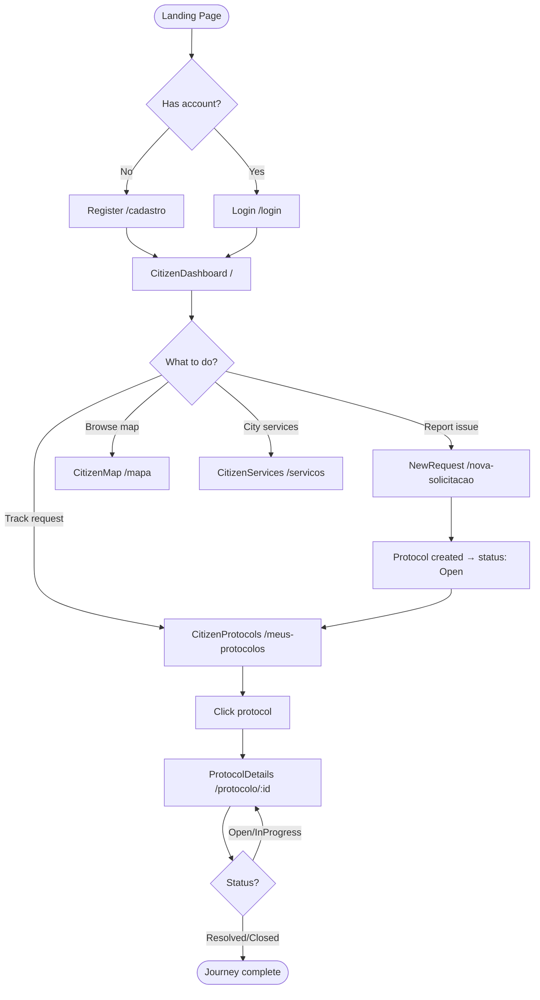

## Public Protocol

Any protocol can also be tracked without login via `/p/:id` ([[PublicProtocol]]).

## Related

- [[Citizen Domain]]
- [[NewRequest]]
- [[CitizenProtocols]]
- [[Protocol Lifecycle]]
- [[Login Flow]]
- [[Register Flow]]
```

- [ ] **Step 3: Create remaining citizen page notes**

**CitizenDashboard.md:**
```markdown
---
tags: [domain/citizen, layer/frontend, type/page]
aliases: [Home Cidadão, Citizen Home, /]
---

# CitizenDashboard

> Citizen landing page after login. Shows quick stats and recent protocols.

## Route

`/` — default route for `role === "citizen"`.

## Code Reference

`src/pages/CitizenDashboard.tsx`

## Related

- [[Citizen Domain]]
- [[Citizen Journey]]
- [[CitizenProtocols]]
```

**NewRequest.md:**
```markdown
---
tags: [domain/citizen, layer/frontend, type/page]
aliases: [Nova Solicitação, New Protocol, /nova-solicitacao]
---

# NewRequest

> Multi-step form for citizens to open a new urban service request.

## Route

`/nova-solicitacao`

## Fields

| Field | Type | Notes |
|-------|------|-------|
| category | Select | Urban issue type |
| description | Textarea | Free-text description |
| address | Text | Location of the issue |

On submit calls `api.createProtocol()` → [[CreateProtocolUseCase]] (backend path) or Supabase directly.

## Code Reference

`src/pages/NewRequest.tsx`

## Related

- [[Citizen Domain]]
- [[Citizen Journey]]
- [[Protocol Domain]]
- [[CreateProtocolUseCase]]
- [[Data Flow]]
```

**CitizenProtocols.md:**
```markdown
---
tags: [domain/citizen, layer/frontend, type/page]
aliases: [Meus Protocolos, My Protocols, /meus-protocolos]
---

# CitizenProtocols

> List of protocols opened by the logged-in citizen.

## Route

`/meus-protocolos`

## Data

Calls `api.getProtocols(userId)` with the citizen's `userId` to return only their protocols.

## Code Reference

`src/pages/CitizenProtocols.tsx`

## Related

- [[Citizen Domain]]
- [[Protocol Lifecycle]]
- [[ProtocolDetails]]
- [[GetProtocolsUseCase]]
```

**CitizenMap.md:**
```markdown
---
tags: [domain/citizen, layer/frontend, type/page]
aliases: [Mapa Cidadão, Citizen Map, /mapa]
---

# CitizenMap

> Leaflet map showing all public protocols in the city.

## Route

`/mapa`

## Code Reference

`src/pages/CitizenMap.tsx`

## Related

- [[Citizen Domain]]
- [[AdminMap]] (admin equivalent)
- [[Protocol Entity]]
```

**CitizenServices.md:**
```markdown
---
tags: [domain/citizen, layer/frontend, type/page]
aliases: [Serviços, City Services, /servicos]
---

# CitizenServices

> Informational page listing available city services and contacts.

## Route

`/servicos`

## Code Reference

`src/pages/CitizenServices.tsx`

## Related

- [[Citizen Domain]]
```

- [ ] **Step 4: Commit**

```bash
git add docs/04-citizen/
git commit -m "docs: add Citizen Domain hub, journey flowchart and all citizen page notes"
```

---

## Task 12: 05-infrastructure — Infrastructure Notes

**Files:**
- Create: `docs/05-infrastructure/Infrastructure Overview.md`
- Create: `docs/05-infrastructure/Supabase.md`
- Create: `docs/05-infrastructure/Database Schema.md`
- Create: `docs/05-infrastructure/Environment Variables.md`
- Create: `docs/05-infrastructure/Deploy.md`

- [ ] **Step 1: Create Infrastructure Overview.md**

```markdown
---
tags: [type/hub, domain/infra]
aliases: [Infrastructure, Infraestrutura, Infra]
---

# Infrastructure Overview

> Hosting, database, and runtime infrastructure for Cidadao Informa.

## Diagram

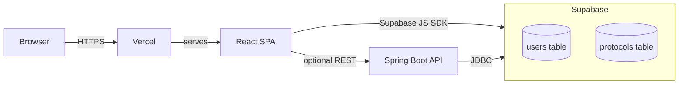

## Notes in This Domain

- [[Supabase]]
- [[Database Schema]]
- [[Environment Variables]]
- [[Deploy]]

## Related

- [[Architecture]]
- [[Tech Stack]]
```

- [ ] **Step 2: Create Supabase.md**

```markdown
---
tags: [domain/infra, layer/database, type/service]
aliases: [Supabase, Database, PostgreSQL]
---

# Supabase

> Hosted PostgreSQL backend used as the primary data store. Accessed via the Supabase JS SDK from the frontend.

## Client Initialization

```typescript
// src/services/supabase.ts
export const supabase: SupabaseClient = createClient(
    process.env.VITE_SUPABASE_URL,
    process.env.VITE_SUPABASE_ANON_KEY
)
```

A hardcoded fallback URL/key is used in dev if env vars are missing (with a console warning).

## Tables

- `users` → [[User Entity]]
- `protocols` → [[Protocol Entity]]

## Access Pattern

The frontend uses the **anonymous key** (RLS-controlled). The Spring Boot backend connects via JDBC using a service-role key from environment variables.

## Related

- [[Infrastructure Overview]]
- [[Database Schema]]
- [[Environment Variables]]
- [[User Entity]]
- [[Protocol Entity]]
```

- [ ] **Step 3: Create Database Schema.md**

```markdown
---
tags: [domain/infra, layer/database, type/diagram]
aliases: [ER Diagram, Schema, Banco de Dados]
---

# Database Schema

> Entity-Relationship diagram for the Supabase PostgreSQL database.

## ER Diagram

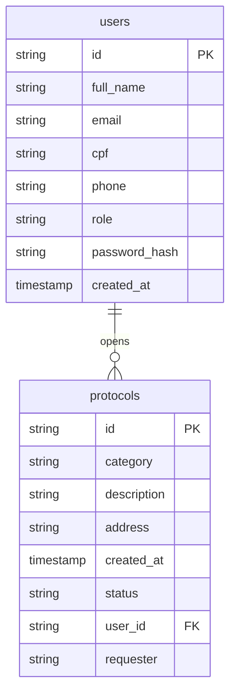

## Status Values

See [[Protocol Lifecycle]] for the full state machine.

## Related

- [[Infrastructure Overview]]
- [[Supabase]]
- [[User Entity]]
- [[Protocol Entity]]
```

- [ ] **Step 4: Create Environment Variables.md**

```markdown
---
tags: [domain/infra, type/config]
aliases: [Env Vars, .env, Environment]
---

# Environment Variables

> Required environment variables for the frontend. Defined in `.env` or Vercel project settings.

## Frontend (Vite)

| Variable | Required | Description |
|----------|----------|-------------|
| `VITE_SUPABASE_URL` | Yes | Supabase project URL |
| `VITE_SUPABASE_ANON_KEY` | Yes | Supabase anonymous (public) key |

If missing, `supabase.ts` falls back to hardcoded values with a `console.warn`.

## Backend (Spring Boot)

Configure in `application.properties` or system env:

| Variable | Description |
|----------|-------------|
| `SPRING_DATASOURCE_URL` | JDBC URL for Supabase PostgreSQL |
| `SPRING_DATASOURCE_USERNAME` | DB username |
| `SPRING_DATASOURCE_PASSWORD` | DB password |
| `JWT_SECRET` | Secret key for JJWT signing |

## Code Reference

`src/services/supabase.ts` — frontend client init

## Related

- [[Infrastructure Overview]]
- [[Supabase]]
- [[Deploy]]
```

- [ ] **Step 5: Create Deploy.md**

```markdown
---
tags: [domain/infra, type/config]
aliases: [Deployment, Vercel, CI/CD]
---

# Deploy

> Deployment configuration for the Cidadao Informa frontend.

## Frontend — Vercel

Configured via `vercel.json`. The SPA is deployed as a static site. All routes rewrite to `index.html` for client-side routing.

```json
// vercel.json (summary)
{
  "rewrites": [{ "source": "/(.*)", "destination": "/index.html" }]
}
```

Build command: `npm run build` → outputs to `dist/`.

## Backend — Spring Boot

Not deployed to a public host in the current setup. Runs locally for academic/hackathon demonstration.

## Related

- [[Infrastructure Overview]]
- [[Environment Variables]]
- [[Tech Stack]]
```

- [ ] **Step 6: Commit**

```bash
git add docs/05-infrastructure/
git commit -m "docs: add infrastructure notes — Supabase, DB schema, env vars, deploy"
```

---

## Task 13: 06-api — API Notes

**Files:**
- Create: `docs/06-api/API Overview.md`
- Create: `docs/06-api/Auth Endpoints.md`
- Create: `docs/06-api/Protocol Endpoints.md`
- Create: `docs/06-api/API Contracts.md`

- [ ] **Step 1: Create API Overview.md**

```markdown
---
tags: [type/hub, domain/overview, layer/api]
aliases: [API, REST API, Endpoints]
---

# API Overview

> All REST endpoints exposed by the Spring Boot backend.

## Endpoint Map

```mermaid
flowchart LR
    API[Spring Boot API :8080]
    API --> Auth[/api/auth]
    API --> Protocols[/api/protocols]
    Auth --> Login[POST /login]
    Auth --> Register[POST /register]
    Auth --> Me[GET /me]
    Protocols --> Create[POST /]
    Protocols --> GetAll[GET /?userId=]
```

## Security

- `POST /api/auth/login` and `POST /api/auth/register` are public
- All other endpoints require `Authorization: Bearer <JWT>` header
- Handled by `JwtAuthenticationFilter` in the security chain

## Notes in This Domain

- [[Auth Endpoints]]
- [[Protocol Endpoints]]
- [[API Contracts]]

## Related

- [[Architecture]]
- [[AuthController]]
- [[ProtocolsController]]
- [[JwtService]]
```

- [ ] **Step 2: Create Auth Endpoints.md**

```markdown
---
tags: [domain/auth, layer/api, type/diagram]
aliases: [Auth API, /api/auth]
---

# Auth Endpoints

> Detailed reference for `/api/auth` endpoints.

## POST /api/auth/login

**Auth required:** No

**Request:**
```json
{ "cpf": "12345678901", "password": "secret123" }
```

**Response 200:**
```json
{
  "token": "<JWT>",
  "name": "João Silva",
  "email": "joao@email.com",
  "cpf": "12345678901",
  "role": "citizen",
  "userId": "<uuid>",
  "createdAt": "2026-01-01T00:00:00Z"
}
```

**Response 401:** `{ "message": "CPF ou senha inválidos." }`

## POST /api/auth/register

**Auth required:** No

**Request:**
```json
{ "name": "João Silva", "email": "joao@email.com", "cpf": "12345678901", "password": "secret123" }
```

**Response 200:** Same shape as login response (token + profile).

**Response 400:** `{ "message": "<validation error>" }`

## GET /api/auth/me

**Auth required:** Yes

**Response 200:** Same shape as login (token field is empty string `""`).

**Response 401:** `{ "message": "Token JWT inválido..." }`

## Related

- [[API Overview]]
- [[Auth Domain]]
- [[AuthController]]
- [[LoginInputDto]]
- [[RegisterInputDto]]
- [[AuthOutputDto]]
```

- [ ] **Step 3: Create Protocol Endpoints.md**

```markdown
---
tags: [domain/protocols, layer/api, type/diagram]
aliases: [Protocol API, /api/protocols]
---

# Protocol Endpoints

> Detailed reference for `/api/protocols` endpoints.

## POST /api/protocols

**Auth required:** Yes

**Request:**
```json
{ "category": "Buraco na via", "description": "Grande buraco na Rua X", "address": "Rua X, 100", "userId": "<uuid>" }
```

**Response 201:**
```json
{
  "id": "<uuid>",
  "category": "Buraco na via",
  "description": "Grande buraco na Rua X",
  "address": "Rua X, 100",
  "createdAt": "2026-05-11T00:00:00Z",
  "status": "Open",
  "userId": "<uuid>",
  "userName": ""
}
```

## GET /api/protocols?userId={userId}

**Auth required:** Yes

**Query Params:**

| Param | Required | Description |
|-------|----------|-------------|
| userId | No | Filter by citizen. Omit for all (admin). |

**Response 200:** Array of `ProtocolOutputDto`

## Related

- [[API Overview]]
- [[Protocol Domain]]
- [[ProtocolsController]]
- [[ProtocolInputDto]]
- [[ProtocolOutputDto]]
```

- [ ] **Step 4: Create API Contracts.md**

```markdown
---
tags: [layer/api, type/diagram, domain/overview]
aliases: [Contracts, API Types, Tipos da API]
---

# API Contracts

> Quick-reference for all request and response shapes used across the API.

## Input Types

| DTO | Used By | Fields |
|-----|---------|--------|
| [[LoginInputDto]] | POST /login | cpf, password |
| [[RegisterInputDto]] | POST /register | name, email, cpf, password |
| [[ProtocolInputDto]] | POST /protocols | category, description, address, userId |

## Output Types

| DTO | Returned By | Key Fields |
|-----|------------|------------|
| [[AuthOutputDto]] | login, register, me | token, name, role, userId |
| [[ProtocolOutputDto]] | GET/POST protocols | id, status, category, userName |

## Error Shape

All error responses use:
```json
{ "message": "Human-readable error description" }
```

Implemented by `ErrorResponse` record:
`backend-java/src/main/java/br/com/fiap/hackgov/api/response/ErrorResponse.java`

## Related

- [[API Overview]]
- [[Auth Endpoints]]
- [[Protocol Endpoints]]
```

- [ ] **Step 5: Commit**

```bash
git add docs/06-api/
git commit -m "docs: add API overview, auth and protocol endpoint notes, API contracts"
```

---

## Task 14: Final — Index commit

- [ ] **Step 1: Final git status check**

```bash
git status
git log --oneline -10
```

Expected: all 35 notes committed across 7 tasks.

- [ ] **Step 2: Final commit (if any stragglers)**

```bash
git add docs/
git commit -m "docs: finalize Obsidian documentation vault"
```
